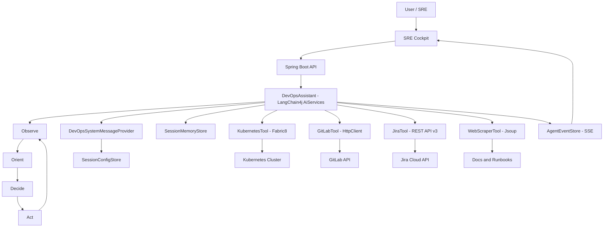

# SRE-Agent
> The Autonomous Site Reliability Engineer for your Kubernetes Cluster.

[](#)
[](#)
[](#)
[](#)
[](LICENSE)

**SRE-Agent** is an **enterprise-grade AIOps framework** for Kubernetes, built in Java, to replace human firefighting with **AI reasoning**.
It implements the **OODA Loop (Observe -> Orient -> Decide -> Act)** to autonomously detect, diagnose, and resolve production incidents, combining **Kubernetes (Fabric8)**, **GitLab**, **Jira**, and **web browsing** into a unified cognitive architecture.

## Demo
https://youtu.be/G__SXo8P7X0

## Features
- 🔭 **Deep Observability:** Direct K8s API integration to inspect pod state and fetch logs in real time.
- 🧠 **Cognitive Diagnosis:** Correlates stack traces with recent GitLab commits to identify likely regressions ("who broke the build").
- 🛠️ **Self-Healing Action:** Executes safe remediation steps such as rolling restarts (and can be extended to rollbacks).
- 🎫 **Incident Management:** Auto-creates Jira tickets with rich context (symptoms, logs, suspected root cause, and next actions).

## Architecture & Technology

### 🗺️ High-level Architecture


### 🧠 Cognitive Architecture (The Brain)
This is not a chatbot. It is an agentic workflow built on **Spring Boot 3** and **LangChain4j**, designed to run the **OODA loop** on live production signals.

- 👁️ **Observe:** Pull real-time cluster state and logs from Kubernetes (pods, restarts, tail logs).
- 🧭 **Orient:** Interpret symptoms, correlate stack traces with recent code changes, and enrich context via targeted web lookups.
- 🤔 **Decide:** Choose the minimal safe action: self-heal for transient failures, or escalate to an incident ticket for code-level bugs.
- ⚙️ **Act:** Execute the decision via tools (e.g., rolling restart) and record the result (e.g., Jira issue + comments).

Key building blocks:
- 🧩 **Persona & System Prompt:** `DevOpsSystemMessageProvider` defines the agent persona as an "Elite SRE" and injects the latest session-scoped external config before every model invocation.
- 🧠 **Memory Management:** `SessionMemoryStore` maintains a per-session message window, enabling multi-turn reasoning keyed by `X-Session-Id`.

### 🧰 Toolchain (The Arsenal)
- ☸️ **Kubernetes Tool (`KubernetesTool`):** Uses the **Fabric8 Kubernetes Client** for native cluster operations (list pods, fetch logs, rolling restarts for Deployments/StatefulSets).
- 🧬 **GitLab Tool (`GitLabTool`):** A lightweight integration built on JDK `HttpClient` to fetch recent commits without heavy SDK dependencies (and can be extended to diffs).
- 🧾 **Jira Tool (`JiraTool`):** Incident lifecycle workflows (search, create, comment) using the Atlassian Jira Cloud **REST API v3** (ADF descriptions for rich context).
- 🌐 **Web Scraper (`WebScraperTool`):** A lightweight **Jsoup**-based fetcher to "Google" error strings and pull troubleshooting hints from docs/posts.

### 🧱 Tech Stack
| Layer | Technology | Purpose |
| --- | --- | --- |
| ☕ Runtime | Java 17 | Modern JVM baseline |
| 🌱 Framework | Spring Boot 3.2.x | API + wiring for tools, sessions, and streaming responses |
| 🧠 Agent Backbone | LangChain4j 0.35.0 | System prompt, tool calling, and memory orchestration |
| ☸️ Kubernetes | Fabric8 Kubernetes Client | Native cluster inspection and remediation |
| 🔌 Integrations | JDK `HttpClient` | GitLab/Jira REST calls without heavy dependencies |
| 🎛️ Frontend | Tailwind CSS | SRE Cockpit UI |

## Getting Started

### ✅ Prerequisites
- 🐳 Docker (required by Minikube)
- ☸️ Minikube + `kubectl`
- ☕ Java 17
- 🧠 OpenAI API Key (`OPENAI_API_KEY`)

### 📦 Installation & Setup
1) Clone the repo:
```bash
git clone https://github.com/<your-org>/SRE-Agent-App.git
cd SRE-Agent-App
```

2) Configure credentials via environment variables (recommended).  
`src/main/resources/application.properties` is already wired to read these at runtime:

- Required:
  - `OPENAI_API_KEY`
- Optional (enables richer demo outputs):
  - GitLab: `GITLAB_URL`, `GITLAB_TOKEN`
  - Jira: `JIRA_URL`, `JIRA_EMAIL`, `JIRA_TOKEN`

Example (macOS/Linux):
```bash
export OPENAI_API_KEY="..."
export GITLAB_URL="https://gitlab.com"
export GITLAB_TOKEN="..."
export JIRA_URL="https://your-domain.atlassian.net"
export JIRA_EMAIL="you@example.com"
export JIRA_TOKEN="..."
```

Example (Windows PowerShell):
```powershell
$env:OPENAI_API_KEY="..."
$env:GITLAB_URL="https://gitlab.com"
$env:GITLAB_TOKEN="..."
$env:JIRA_URL="https://your-domain.atlassian.net"
$env:JIRA_EMAIL="you@example.com"
$env:JIRA_TOKEN="..."
```

3) Start Minikube (if you don’t already have a cluster running):
```bash
minikube start
```

4) Start the Agent App:
```bash
mvn spring-boot:run
```

## Live Demo Scenario (CrashLoopBackOff -> Diagnosis -> Ticket)
This repo includes `bad-deployment.yaml`, which deploys a deliberately crashing `payment-service` (an `nginx` container that prints a simulated `java.lang.NullPointerException`, then exits to trigger `CrashLoopBackOff`).

### 🧪 Crash Simulation (The Story)
1) Deploy the victim workload:
```bash
kubectl apply -f bad-deployment.yaml
```

2) Start the Agent App (if not already running):
```bash
mvn spring-boot:run
```

3) Open the SRE Cockpit:
- `http://localhost:8080`

4) Configure the session scope (required) and start chatting:
- Select **Namespace**: `default`
- Select **Workload**: `Deployment / payment-service`
- (Optional) Enable GitLab/Jira and pick a project
- Click **Apply**

5) Type the incident prompt:
> "The payment-service in the system is down. Please check the logs for me. If it's a simple issue like a CrashLoopBackOff, try restarting it. If it cannot be fixed, please submit a JIRA ticket for me."

### 👀 Expected Behavior (What you will see)
- ☸️ **Detect:** The agent observes pod instability and identifies `CrashLoopBackOff` / repeated restarts.
- 📜 **Inspect:** It fetches logs and surfaces the simulated exception: `java.lang.NullPointerException ... RetryService.java:42`.
- 🧬 **Correlate:** It checks recent GitLab commits (e.g., finds a risky change like `feat: risky change` by a junior dev).
- 🎫 **Escalate:** It creates a Jira ticket (e.g., **"Critical Bug in Payment Service"**) including logs + suspected root cause.
- 🛠️ **Mitigate (optional):** If asked, it can trigger a rolling restart as a short-term mitigation (note: for true code bugs, restarts won’t be a permanent fix).

## Notes
- Session scope (K8s namespace/workload, GitLab project, Jira project key) is stored in `SessionConfigStore` keyed by `X-Session-Id`.
- The agent system prompt is rebuilt every turn and includes the latest session config (credentials are never injected into the prompt).
